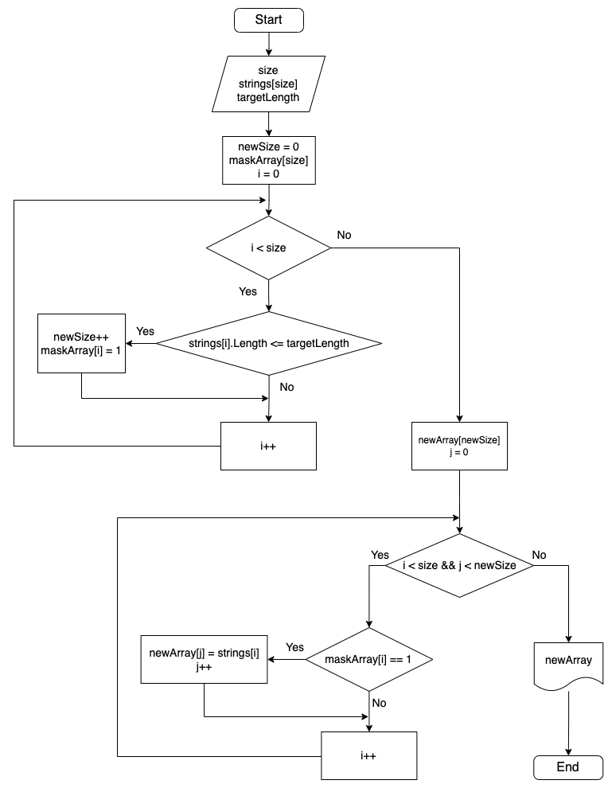

### Задача:
Написать программу, которая из имеющегося массива строк формирует массив из строк, длина которых меньше либо равна 3 символа. Первоначальный массив можно ввести с клавиатуры, либо задать на старте выполнения алгоритма. При решении не рекомендуется пользоваться коллекциями, лучше обойтись исключительно массивами.

### Примеры:
["hello", "2", "world", ":-)"] —> ["2", ":-)"]  
["1234", "1567", "-2", "computer science"] —> ["-2"]  
["Russia", "Denmark", "Kazan"] —> []  

### Решение:
Поскольку по условию задачи рекомендуется пользоваться только массивами, не получится выбрать из заданного массива элементы, удовлетворяющие условию, за один проход, т.к. заранее неизвестен размер результирующего массива. Поэтому за первый проход по заданному массиву считается количество элементов, удовлетворяющих условию, и создаётся массив с маской элементов, которые нужно записать в новый массив. После первого цикла создаётся новый массив размера, равного количеству подходящих элементов. За второй проход по заданному массиву в новый массив записываются элементы по готовой маске.
 
 

